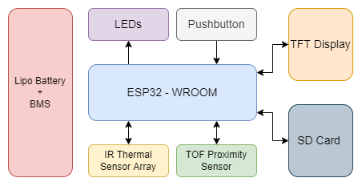
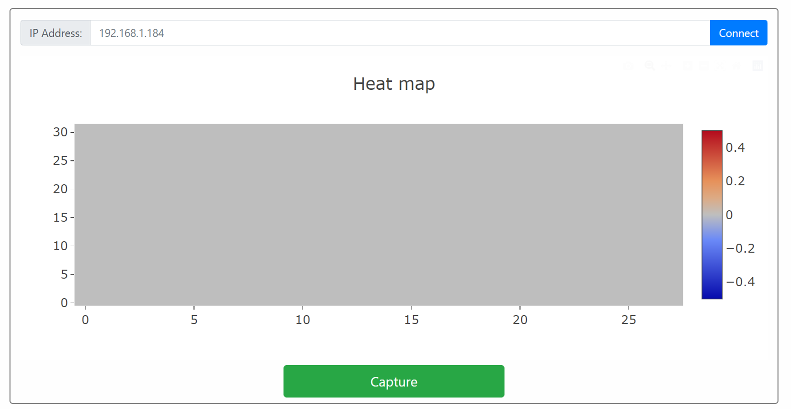

# ESP32 THERMAL CAM

## Assembly
- Enclosure consists of two parts and is held together using self-tapping screws 
- The PCB is attached to the enclosure using self-tapping screws driven into mounting bosses

## Hardware block diagram
- ESP32-WROOM: Control the functionality of the entire design
- LEDs: Indicate the status of the thermal camera
- Pushbutton: Indicate the camera to save the image
- TFT Display: Display thermal images captured by the camera
- SD Card: Store thermal image captured by the camera
- TOF Proximity Sensor: Calculate the proximity of the camera with the surface in front of it
- IR Thermal Sensor Array: Capture IR emissions and create a thermal image of the surface
- LiPo Battery + BMS: Provide power to the camera thereby making it portable

## Application
- Connect with the thermal camera
- Display thermal image with an appropriate legend 
- Capture and save the thermal image 

### Made with lots of ⏱️, 📚 and ☕ by InputBlackBoxOutput
